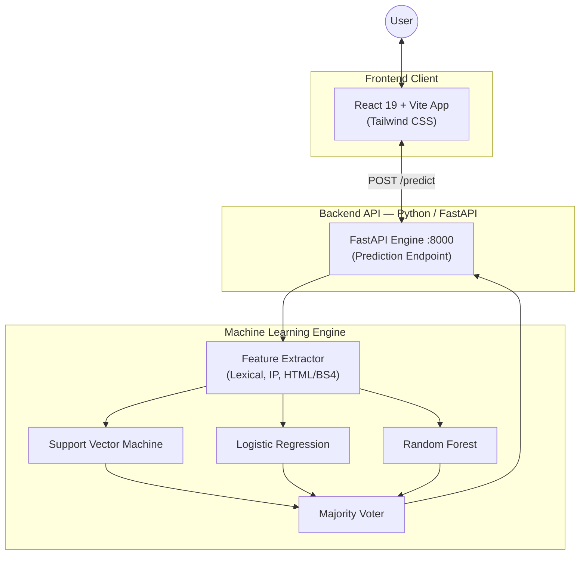
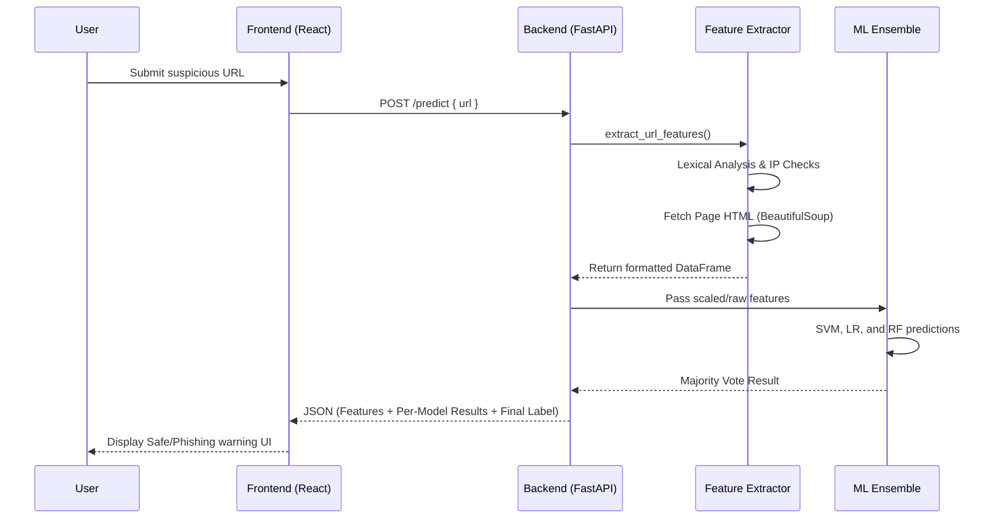

# 🛡️ PhishGuard — AI-Powered Phishing Detection Ecosystem

[](https://reactjs.org/)
[](https://fastapi.tiangolo.com/)
[](https://scikit-learn.org/)
[](https://tailwindcss.com/)

**PhishGuard** is an AI-driven cybersecurity platform that protects users from malicious phishing attempts in real-time. It integrates a machine learning ensemble model built in Python with a clean, highly responsive modern web app, ensuring that your digital experience remains safe by instantly detecting and blocking fraudulent URLs.

---

## 🌟 Key Features

| Area | Feature |
| :--- | :--- |
| 🧠 **ML Ensemble** | Combines **Support Vector Machine (SVM)**, **Logistic Regression**, and **Random Forest** for highly accurate majority-vote prediction. |
| 🕵️ **Deep Extraction** | Analyzes URLs to extract lexical features, domain information, heuristics, and live HTML structural features (e.g., iframes, insecure forms). |
| ⚡ **Real-Time Detection** | Instantaneous URL scanning via a high-performance **FastAPI** continuous backend service. |
| 📱 **Responsive UI** | Beautiful, modern web interface with reactive particle animations, Glassmorphism, and responsive design crafted in **Tailwind CSS v4**. |
| 🔐 **Secure & Fast** | Seamless onboarding powered by **Clerk/Firebase** authentication. |
| 📊 **Analytics Dashboard** | Live statistical metrics and FAQ to help users understand phishing threats. |

---

## 🏗️ System Architecture

### High-Level Architecture



### URL Scanning Workflow



---

## 🛠️ Tech Stack

### Frontend

| Category | Technology |
| :--- | :--- |
| **Framework** | React 19 / Vite |
| **Styling** | Tailwind CSS v4, Framer Motion |
| **Icons & Effects** | Lucide React, React Icons, Ogl, Particles |
| **Auth & DB** | Clerk React, Firebase |
| **Client Req.** | Axios |

### Backend & Machine Learning

| Category | Technology |
| :--- | :--- |
| **API Framework** | FastAPI + Uvicorn |
| **Web Scraping** | Requests, BeautifulSoup4 |
| **Data Processing** | Pandas, Numpy |
| **Machine Learning**| Scikit-learn, Pickle |
| **Models Used** | SVM, Logistic Regression, Random Forest |

---

## 📂 Project Structure

```text
Phishing_Ditection_ML-main/
├── backend/                          # Python FastAPI Backend & ML
│   ├── models/                       # Traing models and scalers
│   │   ├── logistic_regression_model.pkl
│   │   ├── random_forest_model.pkl
│   │   ├── scaler_LR.pkl
│   │   ├── scaler_SVM.pkl
│   │   └── svm_model.pkl
│   ├── app.py                        # FastAPI entry point
│   ├── feature_extract.py            # Logic for feature extraction
│   ├── predict.py                    # Independent terminal testing script
│   └── requirements.txt              # Python dependencies
│
├── Frontend/                         # React 19 + Vite Web Application
│   ├── public/                       # Static assets
│   ├── src/
│   │   ├── assets/                   # Theme images and SVGs
│   │   ├── components/               # UI components (Particles, Spotlights)
│   │   ├── menu/                     # Sections (Header, Footer, FAQ)
│   │   ├── App.jsx                   # Component entry & structure
│   │   ├── Home.jsx                  # Main Landing Page UI
│   │   ├── main.jsx                  # React DOM Renderer
│   │   └── index.css                 # Global CSS and Tailwind Imports
│   ├── eslint.config.js              # Linter rules
│   ├── package.json                  # Node dependencies
│   └── vite.config.js                # Vite build config
│
└── README.md                         # ← You are here
```

---

## 🚀 Getting Started

### Prerequisites

| Requirement | Description |
| :--- | :--- |
| **Node.js** | v18+ |
| **Python** | v3.9+ (with `pip` and `venv`) |

### 1. Clone the Repository

```bash
git clone https://github.com/<your-username>/Phishing_Ditection_ML-main.git
cd Phishing_Ditection_ML-main
```

### 2. Backend Setup (Machine Learning & FastAPI)

```bash
cd backend

# Create & activate a virtual environment
python -m venv venv

# For Windows:
# venv\Scripts\activate
# For Linux / macOS:
# source venv/bin/activate

# Install dependencies (FastAPI, uvicorn, scikit-learn, pandas, bs4)
pip install -r requirements.txt

# Start the FastAPI server
uvicorn app:app --reload
```
> The API will be running at **http://localhost:8000** 

### 3. Frontend Setup (React + Vite)

Open a new terminal window to start the frontend.

```bash
cd Frontend

# Install node dependencies
npm install

# Start the Vite development server
npm run dev
```
> The Frontend will launch at **http://localhost:5173**

---

## 🌐 API Endpoints

### `POST /predict`
Evaluates a URL to determine if it is legitimate or a phishing site.

**Request Body:**
```json
{
  "url": "https://example-suspicious-site.com/login"
}
```

**Response Format:**
```json
{
  "url": "https://example-suspicious-site.com/login",
  "features": {
    "NumDots": 1,
    "UrlLength": 43,
    "IframeOrFrame": 1,
    "...": "..."
  },
  "results": {
    "svm": { "model": "svm", "prediction": 1, "label": "Phishing" },
    "logistic_regression": { "model": "logistic_regression", "prediction": 1, "label": "Phishing" },
    "random_forest": { "model": "random_forest", "prediction": 0, "label": "Legitimate" }
  },
  "majority_vote": {
    "model": "majority_vote",
    "prediction": 1,
    "label": "Phishing"
  }
}
```

---

## 🎨 Design & UX

- **Glassmorphic UI** — Layered components with backdrop-blur effects giving a premium tech feel.
- **Dynamic Particles** — Immersive background effects powered by customized React particle engines.
- **Responsive Layouts** — Flawless scaling from heavy desktop views to compact mobile screens utilizing Tailwind CSS v4 utility classes.
- **Fluid Micro-Interactions** — Integrated animations for hovering, scrolling, and clicking via Framer Motion.

---

## 📄 License

This project is open-source. Please check the repository for specific licensing details.

---

*Build a safer web, one link at a time. 🚀*
